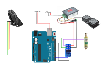

# Arduino Uno Controller

## Parts list.

Some of the links are to google searches, this is because actual products will become unavailable at some point so a list of products that you can select from is probably better.

[Arduino Uno](https://store.arduino.cc/arduino-uno-rev3), this is a link to the official Uno page. You can get unofficial versions much cheaper. Other Arduinos can be used but this is a cost effective board which can be run off the same 12VDC power supply so makes it very convenient. [Ebay arduinos](https://www.google.com/search?q=arduino+uno+ebay&oq=Arduino+uno+ebay)

[Mosfet](https://www.google.com/search?q=15A+400W+DC+5V-36V+Mosfet) Link to google search for appropriate mosfet. This is used by the Arduino to send a pulse of electricity to the solenoid.

[PWM power controller](https://www.google.com/search?q=DC+6-60V+12V+24V+36V+48V+30A+PWM+DC+Motor+Speed+Controller+(PWM)) Link to google search for appropriate PWM opwer controller. This is used to control how much power is sent via the mosfet to the solenoid.

[Power Supply](https://www.google.com/search?q=DC+12V+5A+to+50A+Amp+110V+220V+Power+Supply+12V+-+AC+110+-+220) Link to google search for appropriate 12VDC power supply. The XRN-13/30TL solenoid draws a maximum of 23SuperEZGraverw which is around 1.8 amps so a 5amp power supply will be ample.

[Foot pedal - potentiometer](https://www.google.com/search?q=M-Audio+EX-P+Expression+Controller+Pedal&oq=M-Audio+EX-P+Expression+Controller+Pedal) Link to google search for potentiometer foot pedal. I use this for control of the PWM power controler. It is not absulutly necessary as you can use the potentiometer that comes with the PWM  controller. It does add some flexibility to allow alteration of how much power is transmmitted while engraving. If you want to use one of these you will need to remove the potentiometer on the speed controller and wire the foot pedal in. I removed the extra stuff in the pedal and wired straight to the potentiometer in the pedal. There is a you tube video of the [insides of the pedal](https://www.youtube.com/watch?v=_dJo02ZIpgE)

[Foot pedal - hall effect](https://www.google.com/search?q=Electric+Scooter+Foot+Throttle+Speed+Pedal+Accelerator+Bike+Golf+Cart+Go+Kart) Link to google search for hall effect foot pedal. I use this foot pedal for controling the frequency of the pulses that are sent to the solenoid. You could use a further potentiometer foot pedal for frequency control. The Arduino code will require appropriate parameter changes to use the potentiometer foot pedal.

[Solenoid](https://www.google.com/search?q=XRN-13%2F30TL+12vdc) Link to google search for XRN-13/30TL 12vdc solenoid. This is the tubular solenoid that I've used to power the  fabricated and 3d printed handpieces

 (I did cut off the screw thread and the piston needs to be cut down. I also removed the label from the solenoid so that it's not so tight in the handpiece. Once you have cut off the screw thread from the solenoid and cleaned it up with a file this can be installed into the handpiece. Screw in the inner sleeve add the spring and the piston. Press the piston in so that it's hard up against the solenoid body, then offer up the QC toolholder. You should be able to take a measurement for how far it is protruding from the handpiece. The measurement needs to be for the part which can move inside the handpiece. Subtract 3mm from that measurement and that is how much you should remove from the end of the piston. What you are aiming for is, when the piston is fully depressed the QC toolholder protrudes no more than 3mm from the flat area of the handpiece. Taking off less is better than taking off too much; you can always cut off a bit more but it's much harder to add material back. 2.5mm protruding is probably optimal with the piston fully depressed.)

[Cable connectors](https://www.google.com/search?q=Breadboard+Jumper+Wires+Ribbon+Cables+Kit+for+arduino&oq=Breadboard+Jumper+Wires+Ribbon+Cables+Kit+for+arduino) Link to google search for cable connectors. For connection of the arduino to the other components.

### Other parts

[Cable](https://www.google.com/search?q=Speaker+Cable+2+x+1.5+mm) Link to google search for speaker cable. I've used a cheap speaker cable which seems to work fine.

[Heat shrink tubing](https://www.google.com/search?q=heat+shrink+tubing) Link to google search for heat shrink tubing. If you are soldering cables together the assortment packs are useful for insulation once they are soldered.

You will also require a box to put everything in. I use a clear plastic storage box.

## Arduino code

The code for the arduino can be found in the [src](src) directory of this github project.

[Arduino programming setup guide](https://www.arduino.cc/en/Guide/ArduinoUno) Link to the  guide for setting up the programming environment for the Arduino.

[Arduino setup YouTube](https://www.youtube.com/watch?v=ELUF8m24sZo) Link to the video guide for setting up the programming environment for the Arduino.

## Wiring diagram

[Mosfet and Arduino background](https://bildr.org/2012/03/rfp30n06le-arduino/) This is the background to mosfets for power control using the arduino. I've used a mosfet module that has the mosfet, diode and resister in a package so its much easier to connect the components up.

#### One foot pedal

#### Two foot pedals, one hall effect, one m-audio

#### Two foot pedals, both m-audio note the addition of a jumper between D7 and ground

