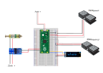

# Raspbery Pi Pico controller

## Parts list.

Some of the links are to google searches, this is because actual products will become unavailable at some point so a list of products that you can select from is probably better.

[Pi Pico](https://www.google.com/search?q=raspberry+pi+pico&oq=raspbery+pi+pico), this is a link to a google search. 

[Mosfet](https://www.google.com/search?q=15A+400W+DC+5V-36V+Mosfet) Link to google search for appropriate mosfet. This is used by the Pico to send a pulse of electricity to the solenoid.

[Power Supply](https://www.google.com/search?q=DC+12V+5A+to+50A+Amp+110V+220V+Power+Supply+12V+-+AC+110+-+220) Link to google search for appropriate 12VDC power supply. The XRN-13/30TL solenoid draws a maximum of 23w which is around 1.8 amps so a 5amp power supply will be ample.

[Foot pedal - potentiometer](https://www.google.com/search?q=M-Audio+EX-P+Expression+Controller+Pedal&oq=M-Audio+EX-P+Expression+Controller+Pedal) Link to google search for potentiometer foot pedal. I use this for control of the PWM power controler. I use 2 of these one for power and one for rpm. These can be replaced by potentiometers I've not tested this on the Pi controller. It does take a little while to get used to 2 pedals but I wouldn't be withoput them now that I've got used to them. If I can get used to them anyone can ;-) I removed the extra stuff in the pedal and wired straight to the potentiometer in the pedal. There is a you tube video of the [insides of the pedal](https://www.youtube.com/watch?v=_dJo02ZIpgE)

[Solenoid](https://www.google.com/search?q=XRN-13%2F30TL+12vdc) Link to google search for XRN-13/30TL 12vdc solenoid. This is the tubular solenoid that I've used to power the  fabricated and 3d printed handpieces

 (I did cut off the screw thread and the piston needs to be cut down. I also removed the label from the solenoid so that it's not so tight in the handpiece. Once you have cut off the screw thread from the solenoid and cleaned it up with a file this can be installed into the handpiece. Screw in the inner sleeve add the spring and the piston. Press the piston in so that it's hard up against the solenoid body, then offer up the QC toolholder. You should be able to take a measurement for how far it is protruding from the handpiece. The measurement needs to be for the part which can move inside the handpiece. Subtract 3mm from that measurement and that is how much you should remove from the end of the piston. What you are aiming for is, when the piston is fully depressed the QC toolholder protrudes no more than 3mm from the flat area of the handpiece. Taking off less is better than taking off too much; you can always cut off a bit more but it's much harder to add material back. 2.5mm protruding is probably optimal with the piston fully depressed.)

[oled display](https://www.google.com/search?q=oled+display) Link to google search for OLED display. To show the power and rpm. I found this useful for debug but its not essential and I don't use it when engraving. I don't know if the code will throw up problems if the OLED is not present, I've not tried it. If you don't want the OLED you may have to remove the code that drives it. 

[Cable connectors](https://www.google.com/search?q=Breadboard+Jumper+Wires+Ribbon+Cables+Kit+for+arduino&oq=Breadboard+Jumper+Wires+Ribbon+Cables+Kit+for+arduino) Link to google search for cable connectors. For connection of the arduino to the other components.

### Other parts

[Cable](https://www.google.com/search?q=Speaker+Cable+2+x+1.5+mm) Link to google search for speaker cable. I've used a cheap speaker cable which seems to work fine.

[Heat shrink tubing](https://www.google.com/search?q=heat+shrink+tubing) Link to google search for heat shrink tubing. If you are soldering cables together the assortment packs are useful for insulation once they are soldered.

You will also require a box to put everything in. I use a clear plastic storage box.

Cable connectors, I don't know what connectors are best, I've tried some audio connectors but wasn't happy with them if you have some insight into what would be suitable let me know and I'll give them a try.

## pico micropython code

The code for the pico can be found in the [src](src) directory of this github project.

[Pico programming setup guide](https://projects.raspberrypi.org/en/projects/getting-started-with-the-pico) Link to the  guide for setting up the programming environment for the pico.

There are lots of video guides for setting up the pico environment use google ;-)

## Wiring diagram

#### Two foot pedals, both m-audio

