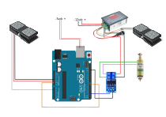

# SuperEZGraver

This is the Super EZ Graver project documentation. If any of the documentation doesn't make sense or links are broken etc please let me know and I'll do my best to fix it.

## Background

I started engraving around 18 months ago after coming across some engraving videos by [Shaun Hughes](https://www.youtube.com/c/express375/videos) on YouTube. I started off with some push engraving while I ordered up the parts for Shaun's "Home made hand engraving machine". I built one of these and proceeded to hack my way through some brass and copper practice plates and I also enjoy making jewellery with enamel. I have now aquired a microscope which has had a marked effect on my engraving, previously I used an optivisor with an added loupe but it is not adequate for my old eyes. 

Shaun had the idea of a solenoid powered engraving system over 2 years ago and posted a video on [YouTube](https://www.youtube.com/watch?v=2177lFeMcNw) and one of the engraving forums. He wasn't the first to come up with the idea, as far as I can find out that was [Steve Lindsay back in 1979](https://www.handengravetools.com/air-engraver-evolution.htm). So its nothing new although the availability of cheap electronic components and the advent of 3d printing has enabled me to put these together to make the Super EZ Graver.

I should also mention that there is a commercial solenoid graver called [PulseGraver](https://pulsegraver.com/) marketed by [Tira Mitchel at engraver.com](http://engraver.com). If you want a ready made system head over there, if you like to tinker yourself you've reached the right place.

The Super EZ Graver that I have built is based around a XRN-13/30TLS solenoid. This is a small tubular solenoid that is 13mm in diameter and 30mm long. It will not plow its way through all materials put before it. You may find that for your purpose it does not pack the punch that you want but it suits me. I've had to adapt my engraving so that it is a bit more refined, which I think is an improvement for me, I no longer bury the tool and break tips. There may be a solenoid out there that will give all of the power and finess that everyone needs in a small package but I doubt it, I suspect that more than one toolpiece will be required and hopefully I'll add more designs and information to this project when it becomes available. 

The controller and power source can handle much more powerful solenoids but I've only tried out a couple, I've made a [list of the ones I've tried](docs/solenoids.md) and added some comments. If you've tried others let me know and I'll add them to the list.  

## Parts list.

Some of the links are to google searches, this is because actual products will become unavailable at some point so a list of products that you can select from is probably better.

[Arduino Uno](https://store.arduino.cc/arduino-uno-rev3), this is a link to the official Uno page. You can get unofficial versions much cheaper. Other Arduinos can be used but this is a cost effective board which can be run off the same 12VDC power supply so makes it very convenient. [Ebay arduinos](https://www.google.com/search?q=arduino+uno+ebay&oq=Arduino+uno+ebay)

[Mosfet](https://www.google.com/search?q=15A+400W+DC+5V-36V+Mosfet) Link to google search for appropriate mosfet. This is used by the Arduino to send a pulse of electricity to the solenoid.

[PWM power controller](https://www.google.com/search?q=DC+6-60V+12V+24V+36V+48V+30A+PWM+DC+Motor+Speed+Controller+(PWM)) Link to google search for appropriate PWM opwer controller. This is used to control how much power is sent via the mosfet to the solenoid.

[Power Supply](https://www.google.com/search?q=DC+12V+5A+to+50A+Amp+110V+220V+Power+Supply+12V+-+AC+110+-+220) Link to google search for appropriate 12VDC power supply. The XRN-13/30TL solenoid draws a maximum of 23w which is around 1.8 amps so a 5amp power supply will be ample.

[Foot pedal - potentiometer](https://www.google.com/search?q=M-Audio+EX-P+Expression+Controller+Pedal&oq=M-Audio+EX-P+Expression+Controller+Pedal) Link to google search for potentiometer foot pedal. I use this for control of the PWM power controler. It is not absulutly necessary as you can use the potentiometer that comes with the PWM  controller. It does add some flexibility to allow alteration of how much power is transmmitted while engraving. If you want to use one of these you will need to remove the potentiometer on the speed controller and wire the foot pedal in. I removed the extra stuff in the pedal and wired straight to the potentiometer in the pedal. There is a you tube video of the [insides of the pedal](https://www.youtube.com/watch?v=_dJo02ZIpgE)

[Foot pedal - hall effect](https://www.google.com/search?q=Electric+Scooter+Foot+Throttle+Speed+Pedal+Accelerator+Bike+Golf+Cart+Go+Kart) Link to google search for hall effect foot pedal. I use this foot pedal for controling the frequency of the pulses that are sent to the solenoid. You could use a further potentiometer foot pedal for frequency control. The Arduino code will require appropriate parameter changes to use the potentiometer foot pedal.

[Solenoid](https://www.google.com/search?q=XRN-13%2F30TL+12vdc) Link to google search for XRN-13/30TL 12vdc solenoid. This is the tubular solenoid that I've used to power the  fabricated and 3d printed handpieces

[Cable connectors](https://www.google.com/search?q=Breadboard+Jumper+Wires+Ribbon+Cables+Kit+for+arduino&oq=Breadboard+Jumper+Wires+Ribbon+Cables+Kit+for+arduino) Link to google search for cable connectors. For connection of the arduino to the other components. 

### Other parts

[connectors - male](https://www.google.com/search?q=1%2F4+Inch+6.35mm+Solder+Stereo+Plug%2C+Ancable+Solder+Type+Plastic+6.35mm+TRS+Phone+Connector+with+Shrinkle+Tube+for+Patch+Cables%2C+XLR+Cables) Link to google search for connectors. I use these for connection of the foot pedals to the PWM controller and Arduino. These are optional you can solder the wires together or use connector blocks.

[connectors - female](https://www.google.com/search?q=1%2F4%22+Stereo+Female+Jack+6.35mm+TRS+Panel+Mount+Socket) Link to google search for connectors. I use these for connection of the foot pedals to the PWM controller and Arduino. These are optional you can solder the wires together or use connector blocks.

[Cable](https://www.google.com/search?q=Speaker+Cable+2+x+1.5+mm) Link to google search for speaker cable. I've used a cheap speaker cable which seems to work fine.

[Heat shrink tubing](https://www.google.com/search?q=heat+shrink+tubing) Link to google search for heat shrink tubing. If you are soldering cables together the assortment packs are useful for insulation once they are soldered.

You will also require a box to put everything in. I use a clear plastic storage box.

## Arduino code

The code for the arduino can be found in the [src](src) directory of this github project.

[Arduino programming setup guide](https://www.arduino.cc/en/Guide/ArduinoUno) Link to the  guide for setting up the programming environment for the Arduino.

[Arduino setup YouTube](https://www.youtube.com/watch?v=ELUF8m24sZo) Link to the video guide for setting up the programming environment for the Arduino.

## Wiring diagram

[Mosfet and Arduino background](https://bildr.org/2012/03/rfp30n06le-arduino/) This is the background to mosfets for power control using the arduino. I've used a mosfet module that has the mosfet, diode and resister in a package so its much easier to connect the components up.

#### One foot pedal

#### Two foot pedals, one hall effect, one m-audio

#### Two foot pedals, both m-audio note the addition of a jumper between D7 and ground

# Handpiece

I've created two 3d modelled handpieces in the open source 3d modelling application [Blender](https://www.blender.org/). The [blender source files](docs/design/XRN13-30TLS/blender) are available to download as well as the [stl](docs/design/XRN13-30TLS/blender/stl). There is a YouTube video on how to [setup the handpiece](https://www.youtube.com/watch?v=aNY35ATTJbg) and also the [Mk2](https://youtu.be/sa4kAdcZSkc) version which has a brass sleve insert. This was first produced using petg but it may be better to use a more heat conductive material such as [ice9](https://tcpoly.com/shop/) for better heat dissapation. I've not tried this yet.

[Anarasha](https://www.youtube.com/channel/UCKSbczGXmN4zeG3NeuPGLAg) had a problem with the blender version of the 3D model as the blender model has tolerances built in to it which causes problems with his slicer(I think). He has kindly produced a [fusion360](docs/design/XRN13-30TLS/fusion360) model of the handpiece which has the [stl](docs/design/XRN13-30TLS/fusion360/stl) and STEP files if this suits you better.

The first handpiece that I made was fabricated from brass and delrin. A YouTube video is available for the [handpiece](https://www.youtube.com/watch?v=D4yPBS8mucQ) along with a video on the handpiece [design refinement](https://www.youtube.com/watch?v=ALAtECnq1Rg)

 
